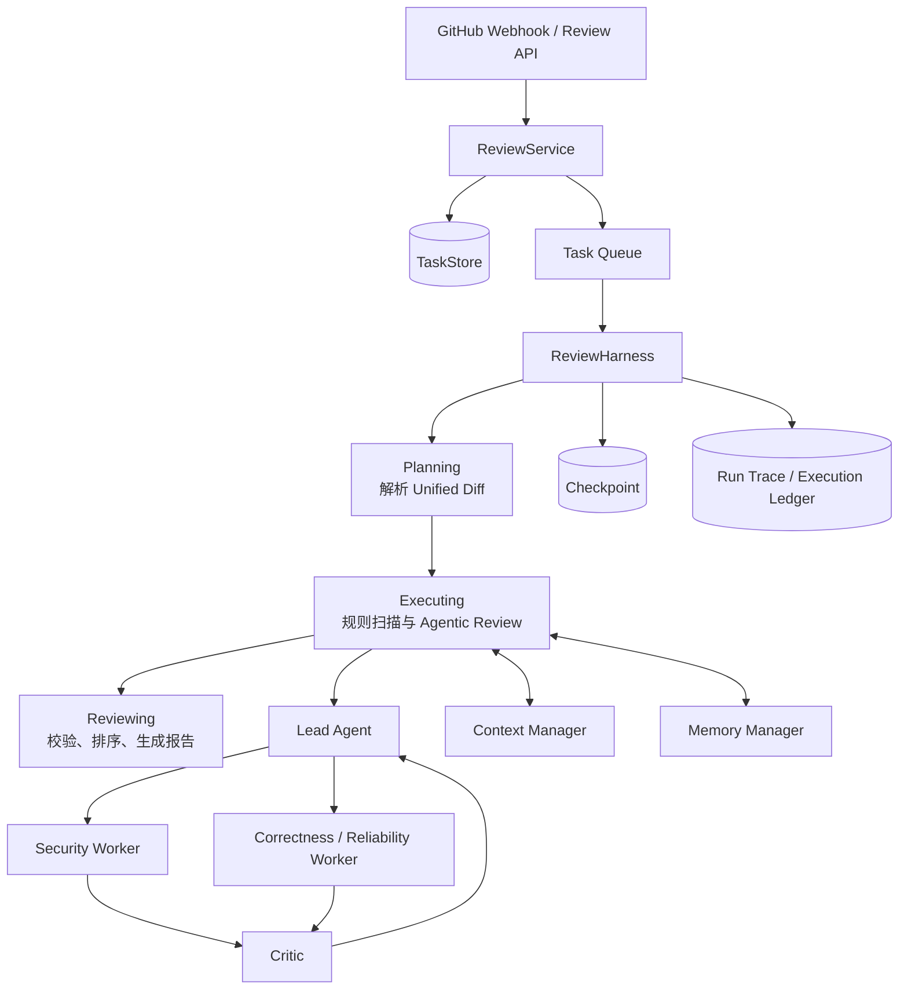

# EvoAgent 项目详解：面向 PR 风险治理的可恢复多智能体系统

> 本文根据简历描述与当前仓库实现整理，主要用于面试讲解、项目复盘和技术追问准备。

## 1. 一句话介绍

EvoAgent 是一个面向研发过程 Pull Request（PR）的风险治理与安全修复系统。它接收 PR Diff，通过规则扫描、LLM Agent、代码检索工具和多 Agent 协作识别安全、正确性与可靠性问题，并输出结构化审查报告；系统重点不只是“让模型审代码”，而是构建了一套具备预算约束、故障恢复、持久化状态、上下文治理和执行审计能力的 Agent Runtime Harness。

## 2. 项目要解决什么问题

传统静态规则可以稳定发现固定模式，但对跨函数调用链、上下文语义和业务约束理解不足；直接让单个大模型审查整个 Diff，又容易遇到以下问题：

- 大 Diff 超出模型上下文窗口，重要代码可能被截断；
- Agent 可能无限调用工具，导致超时、Token 和费用失控；
- 模型或工具临时失败后，任务只能从头执行；
- 单 Agent 容易产生确认偏差，发现的问题缺少独立质疑；
- 中间推理、工具证据和历史经验没有结构化沉淀；
- 服务重启后，内存中的状态丢失，无法恢复生产任务；
- 多租户环境中，不同客户和仓库的审查经验不能串用。

因此，本项目把 PR 审查建模为一个“有状态、可恢复、受预算约束、可审计”的工作流，而不是一次普通的 LLM 请求。

## 3. 总体架构



可以把系统分成三层：

1. **服务层**：接收 API 或 GitHub Webhook，创建任务并交给队列异步执行。
2. **运行时层**：管理任务状态、节点执行、重试、预算、取消、checkpoint 和恢复。
3. **智能体层**：Lead 动态委派任务，Worker 并行审查，Critic 独立质疑，Lead 最终裁决。

## 4. Agent Runtime Harness

### 4.1 Harness 与 Runtime 的职责划分

`ReviewHarness` 是 PR 审查领域的工作流编排器，负责定义审查节点和业务状态流转；`AgentRuntime` 是通用执行内核，负责节点调度、预算检查、重试、取消和 checkpoint。

这种拆分的价值在于：运行时不理解“PR、风险、Finding”等业务概念，只要求节点接收状态并返回字典；业务侧则不需要重复实现故障恢复和预算控制。

### 4.2 任务状态机

外层任务状态如下：

```text
PENDING → PLANNING → EXECUTING → REVIEWING → SUCCESS
   └────────────── 各阶段可进入 FAILED / CANCELLED ──────────────┘
```

各节点职责如下：

| 节点 | 主要工作 | 持久化输出 |
| --- | --- | --- |
| `planning` | 解析 Unified Diff，验证至少包含有效文件和新增行 | 结构化 ParsedDiff |
| `executing` | 执行规则扫描和 Agentic Review | Findings 列表 |
| `reviewing` | 校验与排序 Finding，计算风险等级，组装最终报告 | ReviewReport |

状态转移使用白名单约束。例如 `PENDING` 只能进入 `PLANNING`、`FAILED` 或 `CANCELLED`，避免出现 `PENDING → SUCCESS` 等非法跳转。每次状态变化同时写入任务表和 `trace_events`，形成用户可查看的任务轨迹。

### 4.3 执行预算

系统设置了多层预算，防止 Agent 失控：

- **工作流步数预算**：Runtime 默认最多执行 8 个节点尝试；一次节点尝试，无论成功还是失败，都会消耗一步。
- **工作流时间预算**：默认 120 秒，使用单调时钟计算，避免系统时间调整影响超时判断。
- **角色步数预算**：每个 `BoundedRole` 默认最多进行 4 轮“模型决策 → 工具调用/最终回答”。
- **角色 Token 预算**：默认每个角色 8,000 Token，并根据账本中该角色的实际输入、输出 Token 累计扣减。
- **角色时间预算**：默认每个角色 60 秒。
- **输出预算**：根据上下文窗口、System Prompt 大小和角色剩余 Token 动态限制模型输出。

预算检查发生在每个 Runtime 节点或 Agent Loop 步骤开始前。耗尽后抛出 `RuntimeBudgetExceeded`，而不是继续产生不可控调用。

这里需要注意两个口径：外层 `max_steps` 控制工作流节点尝试次数，内层 `max_steps` 控制单个 Agent 的工具循环次数，两者相互独立。

### 4.4 节点重试

每个 Runtime 节点可以使用全局重试次数，也可以单独覆盖。节点失败时会持久化：

- 节点名称；
- `failed` 状态；
- 当前 attempt；
- 截断后的错误信息；
- 更新时间。

下一次尝试会延续已有 attempt 编号。`ValueError`、主动取消和预算耗尽属于不可重试错误，避免对确定性输入错误或已终止任务做无意义重试。

### 4.5 持久化 Checkpoint

Checkpoint 以 `(task_id, node)` 为主键，保存：

```text
task_id + node + status + attempt + state_json + error + updated_at
```

节点成功后，只保存该节点产生的增量状态，而不是序列化整个 Python 进程。恢复时按节点顺序读取 checkpoint：

1. 若节点为 `completed`，将其 `state_json` 合并到当前状态；
2. 跳过节点 handler，不再重复计算；
3. 从第一个未完成或失败的节点继续执行。

这种方式使 checkpoint 格式归业务存储层管理，不依赖第三方 Agent 框架内部状态，也降低了框架升级导致历史 checkpoint 不兼容的风险。

### 4.6 断点续跑示例

假设第一次运行时：

```text
planning   completed  → Diff 已解析并落库
executing  failed     → 模型服务临时不可用
reviewing  未执行
```

用户调用 Resume API 后，服务从 `task_payloads` 重新取得原始 Diff，再次投递相同 `task_id`。Runtime 会恢复 `planning` 的输出并直接跳过该节点，然后重新执行 `executing`。因此解析工作不会重复，状态轨迹里也只会有一次 `PLANNING`。

除了外层节点 checkpoint，Agentic 模式还保存 `agentic-lead-session`：其中包含委派结果、Worker 输出、返工结果、Critic 决策、Lead 最终决策、上下文压缩摘要和 Execution Ledger。若整个 Lead 会话已经完成，再次恢复时可以直接重建结果，不重复调用模型。

### 4.7 任务取消

取消接口不会粗暴终止线程，而是在任务表中设置 `cancel_requested=1`。Runtime 在进入每个节点尝试前调用 `cancel_check`：

- 检测到取消后抛出 `RuntimeCancelled`；
- Harness 将任务状态更新为 `CANCELLED`；
- 写入取消 Trace。

这是一种协作式取消。优点是状态一致、资源容易清理；边界是正在执行的单次模型或工具调用不会被立即打断，要等控制权回到 Runtime 后生效。

### 4.8 Run Trace 与 Execution Ledger

系统保留两种粒度的可观测数据：

- **任务级 Trace**：记录 `PLANNING`、`EXECUTING`、`REVIEWING`、`SUCCESS/FAILED/CANCELLED` 等业务状态。
- **Agent 执行账本**：记录模型调用、工具调用和各角色事件。

Execution Ledger 汇总以下指标：

- LLM 调用次数、输入/输出/总 Token；
- 按配置单价估算的成本；
- 工具调用次数及成功/失败；
- 每次调用的模型、耗时、错误；
- 每个 Agent 的 `started`、`context_prepared`、`autonomous_decision`、`finished` 等事件；
- Lead 的委派、Worker 回报、返工完成和最终决策事件。

它不仅用于排障，也能回答“为什么这次审查贵”“哪个 Agent 超时”“某条结论用了什么工具证据”等生产问题。

## 5. 上下文压缩

### 5.1 为什么不能直接截断 Diff

按字符从尾部截断会带来两个问题：高风险代码可能恰好位于被截掉部分；Diff 的文件、Hunk 和行号结构也可能被破坏。项目采用确定性的、风险感知的 Hunk 级压缩，让压缩过程可重复、可审计。

### 5.2 风险感知的 Hunk Map-Reduce

上下文压缩大致分为以下步骤：

1. **Parse**：把完整 Diff 拆为多个 Hunk，保留文件路径、Hunk Header、新旧起始行和增删行数。
2. **Map**：为每个 Hunk 提取风险信号、符号、增删规模和路径特征，并计算风险分数。
3. **Chunk**：按 `map_chunk_tokens` 将 Hunk 元数据分块，默认每块约 3,000 Token。
4. **Reduce/Rank**：结合当前角色关注的文件与风险域，对 Hunk 排序。
5. **Select**：在 Diff Token 预算内优先保留高风险 Hunk 的原文。
6. **Excerpt**：单个 Hunk 过大时，保留风险关键词附近、增删行及邻近上下文。
7. **Summarize omitted hunks**：未选中的 Hunk 仍保留语义摘要，而不是完全消失。

压缩结果会记录源 Diff 的 SHA-256、原始/压缩 Token 估算、选中和省略 Hunk 数、风险信号及算法名称，便于审计模型实际看到了什么。

默认相关预算为：

| 配置 | 默认值 | 含义 |
| --- | ---: | --- |
| 上下文窗口 | 32,768 | 模型总上下文容量 |
| 输入预算 | 20,000 | 单次模型调用允许的最大输入 |
| Diff 预算 | 12,000 | Diff 视图占用上限 |
| Observation 预算 | 4,000 | 工具观察占用上限 |
| 保留近期 Observation | 2 条 | 滑动窗口中优先保留的最新原始观察 |

项目使用无外部依赖的保守 Token 估算做调用前检查。它适合预算防护，但不是模型 tokenizer 的精确计数；实际计费与复盘仍以模型返回的 usage 为准。

### 5.3 Observation 压缩

Agent 每调用一次工具，结果会形成结构化 Observation。随着循环进行，Observation 会不断增长。系统采取“语义摘要 + 近期滑动窗口”的方式：

- 较早的 Observation 转成包含工具名、成功状态、证据 ID 和结果形状的摘要；
- 最近若干条尽量保留较完整内容；
- 仍超出预算时，先进一步摘要，再按优先级删除；
- 被删除的历史通过 `observation_rollup` 记录数量，避免静默丢失。

工具结果被明确视为“不可信上下文，而非天然证据”。最终 Finding 还需要经过行号、Diff 证据、门禁和 Critic 校验。

## 6. Memory 管理

### 6.1 Memory 与当前 Prompt 的区别

上下文压缩解决的是“一次调用能放下什么”；Memory 解决的是“跨步骤、跨任务应该记住什么”。Memory 被持久化到 `agent_memories` 表，通过租户、仓库、任务、Agent、Scope 和 Kind 进行组织。

### 6.2 四类 Memory

| 类型 | 生命周期与用途 | 当前项目中的例子 |
| --- | --- | --- |
| Working | 当前任务内的短期工作记忆，默认 TTL 24 小时 | Security Agent 的工具 Observation |
| Episodic | 一次具体审查经历 | 某 Finding 被批准/拒绝、任务完成摘要 |
| Semantic | 从反馈中沉淀的长期事实或经验 | 某仓库曾确认的漏报、误报、坏修复 |
| Procedural | 可复用的做事方法或流程知识 | 某类风险的审查步骤、工具使用策略 |

当前实现中，四种 Scope 都可通过统一 `remember/recall` 接口持久化和检索；自动流水线已经明确写入 Working、Episodic、Semantic。`procedural` 已有存储与检索协议，但当前仓库未看到独立的自动提炼/写入器，因此更准确的表述是“运行时支持 Procedural Memory，自动沉淀链路仍可继续完善”。

### 6.3 Working Memory

工具调用后，系统提取工具名、步骤、成功状态、Evidence ID 和有限长度的结果，写成 `tool_observation`。Working Memory 同时按 `task_id` 和 `agent` 隔离：Security 只能自动取回自己的工作观察，Correctness/Reliability 或 Critic 不会因为同仓库、同任务就读到其他角色的临时思考。

下一轮模型调用前，Working Memory 会注入托管上下文，因此 Agent 可以基于上一轮工具结果继续决策，而不要求模型在不可控的自由文本中“自己记住”。

### 6.4 Episodic 与 Semantic Memory

最终门禁会把 Finding 的批准/拒绝结论写入 Episodic Memory；任务结束后，将紧凑任务摘要归档为 `task_summary`，随后删除该任务的 Working Memory。

用户对报告提交 `false_positive`、`missed_issue`、`bad_fix` 或 `accepted` 反馈时，系统将其写入 Semantic Memory，并给予较高重要性。以后审查同一仓库时，可以召回这些确认过的知识，提高对历史误报和漏报模式的敏感度。

### 6.5 检索与排序

检索首先使用 `(tenant_id, repository, scope)` 做数据库过滤，然后对候选记录进行轻量词法排序：

```text
score = 查询词覆盖率 × 0.55
      + 记忆词特异性 × 0.15
      + importance × 0.25
      + 新近候选的小幅加权
```

默认最多返回 6 条。Working Memory 还可以继续按 `task_id` 和 Agent 过滤。该实现不依赖向量数据库，具有简单、确定、易测试的特点；代价是同义词和深层语义召回能力弱，未来可以在保持租户过滤前置的前提下接入 Embedding 或混合检索。

### 6.6 多租户与仓库隔离

隔离不是只写在 Prompt 里，而是进入数据库查询条件：候选 Memory 必须同时匹配当前 `tenant_id` 和 `repository`。因此即使关键词相同，Tenant A 也不会召回 Tenant B 的记录，同一租户的 `org/repo-a` 也不会污染 `org/repo-b`。

### 6.7 归档与过期清理

- Working Memory 默认设置 TTL，到期记录在检索前被清理；
- 任务完成时先生成 Episodic Summary，再删除该任务的 Working Memory；
- 长期 Episodic/Semantic Memory 默认不设置 TTL，也可通过统一接口指定；
- Memory 内容限制最大长度，并使用内容指纹生成稳定 ID，实现相同记录的幂等写入。

## 7. 多 Agent 协作

### 7.1 为什么采用 Lead/Worker 主从结构

如果让多个 Agent 独立输出后简单拼接，会出现重复 Finding、覆盖范围不一致、冲突无人裁决等问题。Lead/Worker 模式把“任务规划”和“领域审查”分开：Lead 管理目标、覆盖面和质量，Worker 专注具体风险域。

### 7.2 各角色职责

| 角色 | 职责 |
| --- | --- |
| Lead | 根据 Diff 和扫描结果动态委派任务；评估 Worker 输出；发起返工；制定 Critic 目标；最终决定发布哪些 Finding |
| Security Worker | 检查输入到危险调用的传播、权限校验、敏感数据、注入、命令执行等安全风险 |
| Correctness/Reliability Worker | 检查状态变化、异常处理、并发、资源生命周期、兼容性及相关测试缺口 |
| Critic | 对候选 Finding 做盲审，寻找反例、证据不足、行号不准确和误报，并给出显式接受/拒绝意见 |

### 7.3 动态委派

Lead 首先收到压缩后的 Diff、规则扫描结果、可用 Worker 和可用 Skill。它返回结构化 Delegation，例如：

```json
{
  "assignment_id": "security-1",
  "worker": "security",
  "objective": "追踪外部输入是否流入危险执行点",
  "files": ["app.py"],
  "risk_domains": ["injection"]
}
```

系统会校验 Worker 名称、Assignment ID、文件范围和 Skill 是否有效，并为未覆盖的必要角色补全任务，避免 Lead 的格式错误直接破坏工作流。

### 7.4 Worker 并行与有界工具循环

Security 与 Correctness/Reliability 的待执行 Assignment 通过线程池并行运行，降低总审查时延。每个 Worker 使用独立的 `BoundedRole`：

```text
准备有限上下文
    ↓
模型选择 final 或 tool
    ├─ final → 返回 Findings
    └─ tool  → Schema 校验 → 执行 → 生成 Observation
                                  ↓
                            进入下一轮，最多 4 步
```

工具采用显式 Registry，每个工具声明名称、描述、参数 Schema 和 Handler。调用前检查必填字段、未知字段、类型和数值范围；不同角色还有各自的工具权限集合。这同时降低模型幻觉工具名、越权调用和参数注入的风险。

某个 Worker 失败时，异常会被转换为该 Assignment 的结构化 `failed` 结果，而不是直接让并行批次丢失其他 Worker 已完成的结果。

### 7.5 最多两轮返工

Lead 收到 Worker 结果后进入 `assess-workers` 阶段，可以提出结构化返工请求：

- 指定原 Assignment；
- 给出返工 Guidance；
- 列出必须补充的 Evidence。

系统最多允许两轮返工。每轮返工使用独立 `run_id`，结果和阶段都会写入 Lead Session Checkpoint。如果已没有返工请求，则提前停止；若到达上限仍有请求，则以 `revision-budget-exhausted` 记录停止原因。

这个机制在质量与成本之间做了显式平衡：允许 Lead 修正一次空泛或缺证据的结论，但不允许 Agent 之间无限来回讨论。

### 7.6 Critic 的盲审机制

Critic 收到候选 Finding 时，系统重新构造字段，只包含 Finding 内容、证据、行号、修复和置信度，不包含 `source` 等候选来源身份。因此 Critic 不知道结论来自规则扫描、Security 还是 Reliability，可以减少对特定来源的权威偏见。

Critic 必须对每个候选给出显式 Decision，包括：

- 是否接受；
- 反对理由；
- 置信度调整。

没有明确决策的候选会被视为存在“Critic 未返回显式结论”的异议。Critic 之后，Lead 仍负责最终综合，而不是把发布权交给 Critic。

### 7.7 Lead 最终综合

Lead 在 `finalize` 阶段同时看到：

- Worker 结果；
- Critic 决策；
- 带编号的候选 Finding；
- 历史召回 Memory；
- 变更行和工具证据。

Lead 返回最终接受的 Finding 索引和置信度调整。系统再做去重、排序和门禁，生成报告。这样责任链是清晰的：Worker 发现问题，Critic 挑战问题，Lead 对最终发布负责。

## 8. 一次完整执行流程

```text
1. GitHub PR Webhook 到达，服务校验签名并创建任务
2. 保存原始 Diff，任务进入队列
3. Runtime 执行 planning，解析文件、Hunk 和新增行并保存 checkpoint
4. executing 阶段运行确定性规则扫描
5. Context Manager 生成风险排序后的有限 Diff 视图
6. Memory Manager 召回当前租户、当前仓库的历史经验
7. Lead 根据风险动态创建 Security 和 Reliability Assignment
8. 两类 Worker 并行执行有界工具循环
9. Lead 评估结果，必要时发起最多两轮返工
10. Critic 隐藏来源后独立质疑候选 Finding
11. Lead 综合 Worker、Critic、Memory 和证据做最终决策
12. reviewing 阶段校验、去重、排序并计算总体风险等级
13. 保存报告、Run Trace、Execution Ledger 和完成态 checkpoint
14. 将批准/拒绝结论与任务摘要归档，清理 Working Memory
```

## 9. 关键设计取舍

### 9.1 自研轻量 Runtime，而不是直接依赖通用 Agent 框架

优势是状态格式、预算语义、重试边界和 checkpoint 都可控，易于与现有任务表、API 和审计体系结合；同时节点协议简单，测试时不需要启动复杂外部组件。代价是并行 DAG、分布式调度和可视化编排能力需要自行建设。

### 9.2 增量状态 Checkpoint，而不是进程快照

增量 JSON 更可读、跨版本风险更低，也方便人工排障；代价是所有节点输出必须可序列化，Schema 演进时需要兼容旧数据。

### 9.3 确定性压缩，而不是再调用一个 LLM 做摘要

确定性算法无额外模型成本，可复现并能保留 Diff 行结构；代价是对业务语义的理解弱于模型摘要。因此系统用风险关键词、路径、符号和变更规模综合排序，并保留 omitted summary 降低遗漏概率。

### 9.4 词法 Memory 检索，而不是直接上向量数据库

当前方案部署简单、查询可解释、隔离条件明确，适合项目现阶段；不足是语义召回能力有限。生产扩展时可以采用“tenant/repository 强过滤 + BM25/Embedding 混合排序”。

### 9.5 协作式取消

它保持数据状态一致，但取消粒度停留在节点边界。若要实现更及时的取消，需要模型客户端和工具 Handler 支持 timeout、Cancellation Token 或可中断请求。

## 10. 如何证明这些能力不是口头设计

仓库测试覆盖了以下关键场景：

- Runtime 第二次执行时恢复已完成 checkpoint，节点不重复调用；
- `planning` 成功、`executing` 失败后，可从最后完成节点继续；
- 工具参数不符合 Schema 时，Handler 不会被调用；
- Memory 按 Tenant 和 Repository 隔离；
- 过期 Working Memory 在 Recall 前被清理；
- 工具 Observation 能在下一轮 Agent 调用中被看到；
- 任务归档后 Working Memory 被删除，Episodic Summary 被保留；
- Working Memory 按 Agent Role 隔离；
- Lead 能动态委派、要求 Worker 返工并完成综合；
- 完成的 Lead Session 恢复后不再产生任何模型调用；
- Gate Decision 和任务摘要可被未来任务召回。

## 11. 面试时的两分钟讲法

> 这个项目是一个面向 PR 风险治理的多 Agent 审查和修复系统。我的重点不是简单调用大模型，而是解决 Agent 在生产环境中的可控性和可恢复性问题。
>
> 外层我实现了一个轻量 Agent Runtime，把一次审查拆成 planning、executing、reviewing 三个持久化节点。Runtime 统一管理步数和时间预算、节点重试、协作式取消、状态机以及 checkpoint。每个节点成功后只保存增量 JSON 状态；如果模型服务中途失败或进程重启，恢复时会跳过已完成节点，从第一个失败节点继续。除此之外，Lead 多 Agent 会话也单独做 checkpoint，已完成的委派和模型调用不会重复执行。
>
> 大 Diff 场景下，我没有直接截断文本，而是按 Hunk 做风险感知的 Map-Reduce：解析文件和 Hunk，结合风险关键词、路径、变更规模和当前 Agent 的关注域排序，在 Token 预算内保留高风险原文，并为省略部分保留摘要。工具 Observation 使用语义摘要加近期滑动窗口，确保每次模型输入有界。
>
> Memory 层按 Working、Episodic、Semantic、Procedural 四种 Scope 建模，并通过 Tenant 和 Repository 做强隔离。工具结果进入 Working Memory，任务结束后转成 Episodic Summary 并清理短期数据，用户确认的误报、漏报和坏修复进入 Semantic Memory供未来审查召回。
>
> 多 Agent 使用 Lead/Worker 模式。Lead 动态委派 Security 和 Correctness/Reliability Worker 并行审查，对证据不足的结果最多发起两轮返工；Critic 在隐藏候选来源后做独立盲审，最后由 Lead 综合发布。所有模型调用、工具调用、Token、成本、耗时和决策事件都写入 Execution Ledger，能够完整复盘一次审查为什么得到某个结论。

## 12. 高频追问与回答

### Q1：为什么 checkpoint 保存节点输出，而不是保存整个 State？

节点输出是状态增量，体积更小，职责更清晰。恢复时按拓扑顺序合并即可重建完整状态，也便于判断某一节点具体产生了哪些数据。整个 State 快照虽然恢复简单，但容易重复存储大 Diff，并增加 Schema 演进和敏感数据治理难度。

### Q2：如何保证节点可以安全重试？

Runtime 本身保证 attempt 和 checkpoint 语义，但节点是否幂等仍是业务责任。当前解析和审查节点以确定性输入生成结果，checkpoint 使用 `(task_id, node)` Upsert；外部副作用应使用 `task_id` 或幂等键。像 PR 评论回写这类操作应使用 Upsert，而不能每次恢复都新增评论。

### Q3：恢复之后预算会重新计算吗？

外层 Runtime 的本次 wall-clock 和 step 预算从 Resume 调用重新开始，已完成节点不消耗新的执行步。Lead Session 的历史模型/工具账本会从 checkpoint 恢复，因此审计汇总不会丢失。单个 `BoundedRole` 计算的是本次角色激活相对其启动时的 Token 增量；这是当前实现边界，若需要跨多次 Resume 的严格全局费用上限，应再增加任务级累计预算门禁。

### Q4：为什么 Critic 要隐藏来源？

如果 Critic 知道某个 Finding 来自 Security Agent 或确定性规则，可能产生权威偏见。隐藏 `source` 后，它只能依据代码、行号、解释和证据判断，从而让质疑更独立。不过“隐藏来源”不等于隐藏 Finding 内容，也不是密码学匿名。

### Q5：如何防止多 Agent 让成本成倍增加？

通过角色级 Token、时间和步数预算限制单 Agent；通过动态委派避免所有角色审查所有文件；Worker 并行减少墙钟时间；返工最多两轮；上下文压缩减少每次调用输入；Execution Ledger 记录实际 Token 与成本，支持后续按角色调优。

### Q6：Memory 会不会把错误结论不断放大？

Working Observation 被标记为不可信上下文，最终仍要通过证据和门禁；长期 Semantic Memory 主要来自用户确认反馈，并带有 Kind、Importance 和元数据；召回数量受限。进一步增强可以增加来源置信度、人工审批、冲突消解和负反馈衰减。

### Q7：租户隔离只靠应用代码是否足够？

当前实现把 Tenant 和 Repository 放入 Memory 的存储与查询条件，并有测试验证。更严格的生产环境还可以使用 PostgreSQL Row-Level Security、租户独立密钥、审计告警和渗透测试，形成纵深防御。

### Q8：上下文压缩会不会漏掉跨 Hunk 调用链？

存在这种风险。因此系统不会只看关键词：还结合当前关注文件、风险域、符号和规则扫描结果排序，并允许 Agent 通过受控仓库工具继续检索定义、引用和调用关系。未来可加入静态调用图，让相关 Hunk 成组进入上下文。

## 13. 更严谨的简历表述建议

原表述整体成立，但为了让技术边界更清楚，可以改成：

> **项目描述：** 面向研发过程 PR 的风险治理与安全修复智能体，设计并实现具备持久化状态、预算约束和故障恢复能力的 Agent Runtime Harness。
>
> **Agent Runtime Harness：** 实现任务状态机与节点化执行引擎，统一管理步数/时间预算、节点级重试、协作式取消、持久化 Checkpoint、断点续跑及 Run Trace；支持从最后成功节点恢复，并持久化 Lead 多 Agent 会话，避免重复模型调用。
>
> **上下文压缩与 Memory 管理：** 设计风险感知的 Hunk Map-Reduce 与 Observation 滑动窗口，在 Token 预算内生成可审计的有限上下文；按 Working、Episodic、Semantic、Procedural 四类 Scope 建模记忆，支持租户/仓库/任务/角色隔离检索、任务归档与 TTL 清理，其中自动沉淀链路覆盖 Working、Episodic 和 Semantic Memory。
>
> **多 Agent 协作：** 设计 Lead/Worker 主从式协作协议，Lead 负责动态委派、Worker 结果评估、最多两轮证据驱动返工及最终综合；Security 与 Correctness/Reliability Worker 并行执行有界工具循环，Critic 隐藏候选来源进行独立盲审，降低单 Agent 确认偏差与误报。

## 14. 当前能力边界与后续演进

- Procedural Memory 已有通用 Scope 支持，但缺少从高质量审查轨迹自动提炼流程的专用实现；
- Runtime 的取消发生在节点或 Agent 步骤边界，无法强制中断正在进行的外部调用；
- Token 预估是保守近似值，不等于供应商 tokenizer 的精确结果；
- 当前 Memory 检索以关键词重叠为主，复杂语义召回可以引入混合检索；
- Worker 使用线程池并行，跨进程和跨机器调度仍依赖外层队列能力；
- JSON Checkpoint 需要版本字段和迁移策略，才能长期兼容运行中的历史任务；
- 最多两轮返工是固定上限，未来可以结合风险等级、剩余预算和边际收益动态停止。

这些边界不影响当前设计价值，反而说明项目已经把 Agent 从“Prompt Demo”推进到可讨论可靠性、成本、恢复语义和多租户隔离的工程系统。
